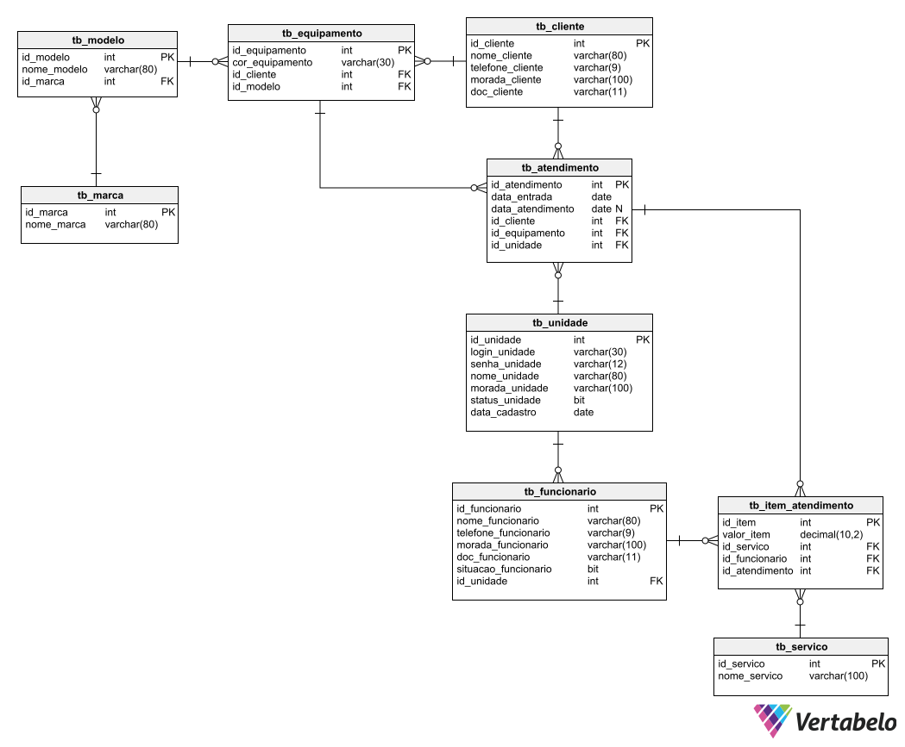
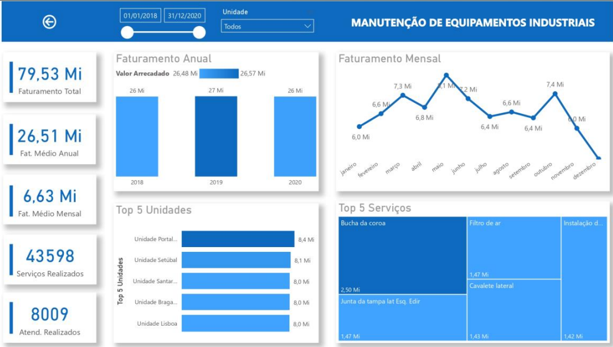

  <h1>Equipamentos Industriais - Desenvolvimento de banco de dados relacional, modelo para análise de dados e relatórios</h1>

_________________

### Sobre
O presente projeto tem como objetivo a implementação de uma base de dados, sua manipulação e transformação em modelo de análise de dados de uma empresa fictícia, cujo enquadramento de segue.

### Tecnologias
- SQL Server
- VBA

## Enquadramento
A empresa dispõe de vários centros de atendimento onde realiza a prestação de serviços de manutenção em equipamentos industriais. Cada centro de atendimento possui seus próprios funcionários, no qual realizam os diversos serviços oferecidos a variados clientes. Atualmente cada unidade realiza o registo de suas atividades de forma distinta, algumas utilizam softwares de terceiros, outras fazem de forma manual, o que dificulta a análise dos dados e tomada de decisão da alta gerência que representa as unidades.
A empresa busca centralizar os registos dos centros de atendimento, tendo como principal fonte de informação os atendimentos realizados, onde constarão a data de entrada, a data do atendimento – caso algum seja realizado, o preço, serviços e funcionários responsáveis. Assim pretende-se facilitar o benchmarking e a análise de desempenho, permitindo perceber as principais deficiências de cada unidade e tomar decisões importantes.

## Regras de negócio para elaboração do banco de dados
1) Um centro de atendimento terá um e somente um cadastro de usuário/senha para aceder ao sistema, onde registará os atendimentos realizados. 
2) Os centros de atendimento terão funcionários diferentes, os mesmos não poderão ser compartilhados entre outros centros de atendimento. 
3) Os centros de atendimento que finalizarem o vínculo com a empresa, bem como seus registos deverão continuar a existir, sendo possível identificá-los diferindo dos atualmente vinculados. 
4) Os atendimentos são realizados individualmente para cada equipamento, onde pode ter sido realizado vários serviços, constando em cada um deles o preço e o funcionário responsável. 
5) Em um atendimento, não podem conter itens repetidos no qual um determinado serviço é feito pelo mesmo funcionário. 
6) Um funcionário é de somente um centro de atendimento, um centro de atendimento pode ter vários funcionários. 
7) Os funcionários devem ser classificados como ativos (para os que estão atualmente vinculados a organização) ou inativos (para os que não fazem mais parte da organização).
8)  Um atendimento é de somente um centro de atendimento, um centro de atendimento pode ter vários atendimentos. 
9) Deve ser possível identificar a data em que um atendimento foi realizado, se realizado.
10) Um atendimento cuja data do atendimento esteja preenchida deve ter pelo menos um item vinculado, neste item deve estar registado o serviço realizado, o valor e o funcionário responsável. 
11) Um atendimento é de somente um cliente, um cliente pode ter vários atendimentos. 
12) Um atendimento é de somente um equipamento, um equipamento pode ter vários atendimentos.
13) Um item é de somente um atendimento, um atendimento pode ter vários itens. 
14) Um item é de somente um serviço, um serviço pode ter vários itens. 
15) Um item é de somente um funcionário, um funcionário pode ter vários itens. 
16) Um equipamento é de somente um cliente, um cliente pode ter vários equipamentos. 
17) Um equipamento é de somente um modelo, um modelo pode ter vários equipamentos. 
18) Um modelo é de somente uma marca, uma marca pode ter vários modelos. 

## Modelo Entidade-Relacionamento

  

## Povoamento
O povoamento da base de dados foi feito utilizando VBA e dados gerados aleatóriamente, de forma com que se pudesse possibilitar a utilização das ferramentas e simular a estrutura para uma análise de dados, o mcódigo utilizado segue em <a href="">vba-povoamento</a>.

## Índices e Views
<a href="">indices.sql</a> e <a href="">views.sql</a>.

## Procedures
<a href="">procedures.sql</a>.

##Triggers
<a href="">triggers.sql</a>.

## Queries
<a href="">queries.sql</a>.

## Análise de Dados
No projeto foi optado pela criação das views <a href="">queries.sql</a>, facilitando a geração da tabela fato e das dimensões. Como o objetivo do projeto foi apenas de treinamento, não foi elaborada uma estrutura sólida de dados, bases intermediárias e fluxo bem estabelecido de atualiazações. O modelos star schema foi carregado diretamente no Power Query, onde foram realizados tratamentos e posteriormente criado medias para a geração do relatório final.

  

